# 🏠 HA-MCP 工具完整指南

> **版本**: v7.6.0 | **工具數量**: 86 | **分類**: 26 個領域
> **支援 Agent**: Claude Code · OpenClaw · Hermes Agent
> **部署模式**: HA OS Add-on (HTTP) · Stdio (PyPI/uvx)

---

## 目錄

- [系統架構](#系統架構)
- [連線方式](#連線方式)
- [Agent 整合示範](#agent-整合示範)
- [工具總覽](#工具總覽)
- [工具詳細文件](#工具詳細文件)
  - [搜尋與探索 (Search & Discovery)](#搜尋與探索-search--discovery)
  - [服務與裝置控制 (Service & Device Control)](#服務與裝置控制-service--device-control)
  - [自動化 (Automations)](#自動化-automations)
  - [腳本 (Scripts)](#腳本-scripts)
  - [場景 (Scenes)](#場景-scenes)
  - [儀表板 (Dashboards)](#儀表板-dashboards)
  - [實體登錄 (Entity Registry)](#實體登錄-entity-registry)
  - [裝置登錄 (Device Registry)](#裝置登錄-device-registry)
  - [輔助實體 (Helper Entities)](#輔助實體-helper-entities)
  - [區域與樓層 (Areas & Floors)](#區域與樓層-areas--floors)
  - [標籤與分類 (Labels & Categories)](#標籤與分類-labels--categories)
  - [歷史與統計 (History & Statistics)](#歷史與統計-history--statistics)
  - [行事曆 (Calendar)](#行事曆-calendar)
  - [待辦清單 (Todo Lists)](#待辦清單-todo-lists)
  - [藍圖 (Blueprints)](#藍圖-blueprints)
  - [附加元件 (Add-ons)](#附加元件-add-ons)
  - [HACS](#hacs)
  - [整合管理 (Integrations)](#整合管理-integrations)
  - [群組 (Groups)](#群組-groups)
  - [能源 (Energy)](#能源-energy)
  - [攝影機 (Camera)](#攝影機-camera)
  - [檔案系統 (Files)](#檔案系統-files)
  - [區域 (Zones)](#區域-zones)
  - [語音助理 (Assist)](#語音助理-assist)
  - [系統管理 (System)](#系統管理-system)
  - [工具程式 (Utilities)](#工具程式-utilities)

---

## 系統架構

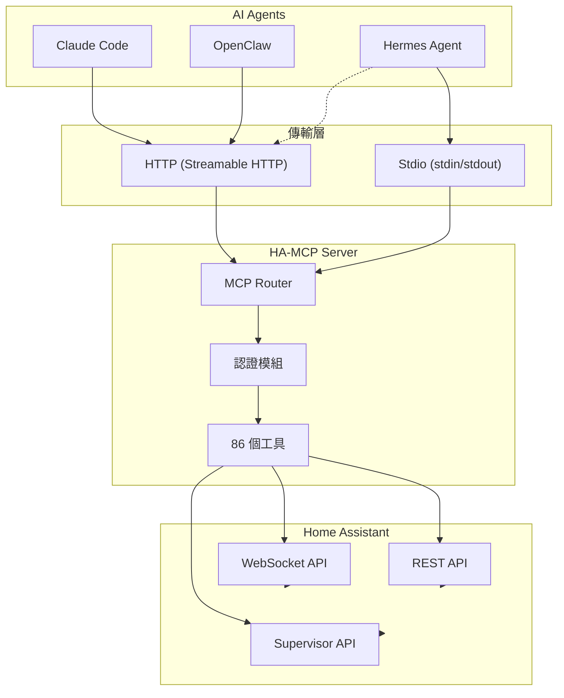

### 工具分類架構

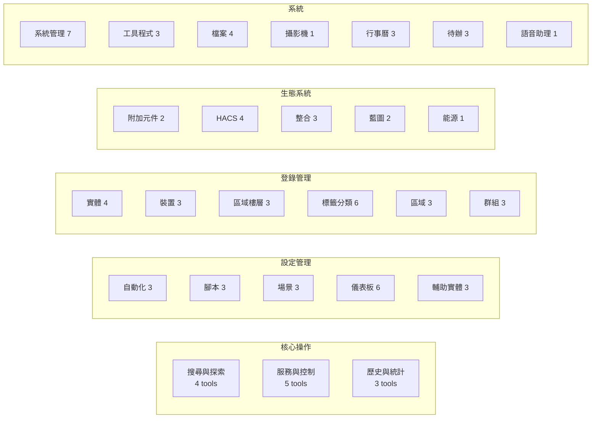

---

## 連線方式

### 方式一：HA OS Add-on（推薦，適用 HAOS / Supervised）

> 透過 HTTP Streamable HTTP 協定連線，Add-on 直接在 HA OS 內執行。

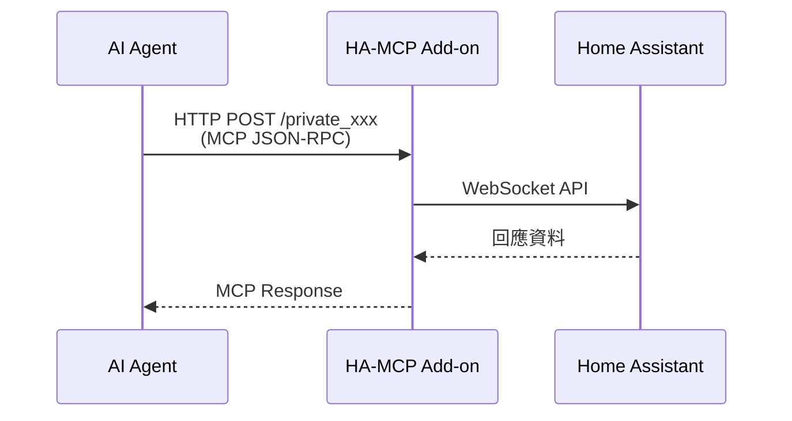

**設定方式：**

1. 在 HA 中新增存放庫：`https://github.com/WOOWTECH/ha-mcp`
2. 安裝「Home Assistant MCP Server」附加元件
3. 啟動 Add-on，取得 Secret Path（如 `/private_qk1mdANWdFCrjW5wRSQmcA`）
4. Agent 設定 URL：`http://<HA_IP>:9583/<secret_path>`

### 方式二：Stdio 模式（適用任何 HA 安裝，含遠端 VPS）

> 透過 stdin/stdout 通訊，ha-mcp 以 Python 套件直接在本機執行。

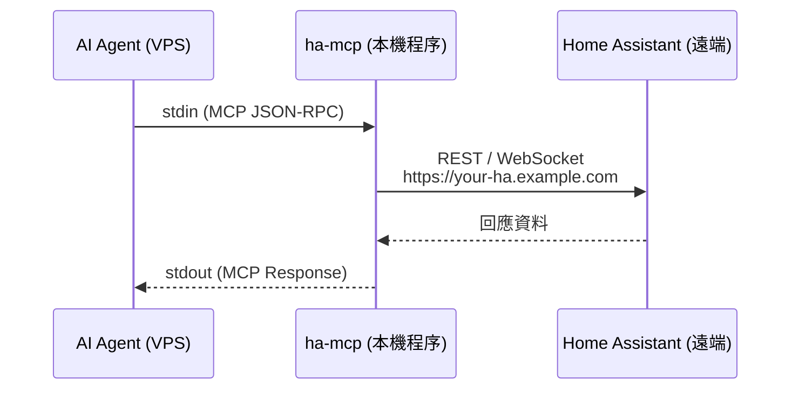

**安裝方式：**

```bash
# 使用 uvx（推薦）
uvx ha-mcp

# 或使用 pip
pip install ha-mcp
```

**環境變數設定：**

```bash
export HA_URL="https://your-ha-domain.com"
export HA_TOKEN="your_long_lived_access_token"
```

### 方式三：HTTP 模式（獨立伺服器）

> 在任何機器上以 HTTP 伺服器模式執行 ha-mcp，Agent 透過 HTTP 連線。

```bash
uvx ha-mcp --transport http --port 8765
```

---

## Agent 整合示範

### Claude Code 設定

**方式 A — HTTP（透過 Add-on）：**

```json
// ~/.claude/settings.json
{
  "mcpServers": {
    "ha-mcp": {
      "type": "http",
      "url": "http://192.168.2.12:9583/private_qk1mdANWdFCrjW5wRSQmcA"
    }
  }
}
```

**方式 B — Stdio（透過 uvx）：**

```json
{
  "mcpServers": {
    "ha-mcp": {
      "command": "uvx",
      "args": ["ha-mcp"],
      "env": {
        "HA_URL": "https://your-ha.example.com",
        "HA_TOKEN": "your_long_lived_access_token"
      }
    }
  }
}
```

**使用範例：**

```
使用者：把客廳的燈調暗到 30%
Claude：我來幫你調整客廳燈光。

[呼叫 ha_search_entities(query="客廳", domain_filter="light")]
→ 找到 light.living_room_light

[呼叫 ha_call_service(domain="light", service="turn_on",
  entity_id="light.living_room_light", data={"brightness_pct": 30})]
→ 已將客廳燈光調整至 30%
```

### OpenClaw 設定

**settings.yaml：**

```yaml
mcp_servers:
  ha-mcp:
    type: http
    url: "http://192.168.2.12:9583/private_qk1mdANWdFCrjW5wRSQmcA"
```

**使用範例：**

```
使用者：今天客廳溫度怎麼樣？
OpenClaw：讓我查詢一下。

[呼叫 ha_get_history(entity_ids="sensor.living_room_temperature",
  source="statistics", period="hour")]
→ 今日客廳溫度：最低 22.3°C、最高 27.1°C、平均 24.6°C
```

### Hermes Agent 設定

**~/.hermes/config.yaml（Stdio 模式）：**

```yaml
mcp_servers:
  ha-mcp:
    command: "uvx"
    args: ["ha-mcp"]
    env:
      HA_URL: "https://woowtechhaosrpi5-ha.woowtech.io"
      HA_TOKEN: "your_long_lived_access_token"
```

**~/.hermes/config.yaml（HTTP 模式）：**

```yaml
mcp_servers:
  ha-mcp:
    url: "http://192.168.2.12:9583/private_qk1mdANWdFCrjW5wRSQmcA"
```

**使用範例：**

```
使用者：建立一個早上 7 點自動開燈的自動化
Hermes：我來幫你建立這個自動化。

[呼叫 ha_config_set_automation(config={
  "alias": "早晨自動開燈",
  "trigger": [{"platform": "time", "at": "07:00:00"}],
  "action": [{"service": "light.turn_on",
              "target": {"entity_id": "light.bedroom_light"}}]
})]
→ 已建立自動化「早晨自動開燈」
```

---

## 工具總覽

| 分類 | 數量 | 說明 |
|------|------|------|
| [搜尋與探索](#搜尋與探索-search--discovery) | 4 | 實體搜尋、狀態查詢、系統概覽、深度搜尋 |
| [服務與裝置控制](#服務與裝置控制-service--device-control) | 5 | 服務呼叫、批量控制、事件發布、操作追蹤 |
| [自動化](#自動化-automations) | 3 | 取得/建立/刪除自動化設定 |
| [腳本](#腳本-scripts) | 3 | 取得/建立/刪除腳本設定 |
| [場景](#場景-scenes) | 3 | 取得/建立/刪除場景設定 |
| [儀表板](#儀表板-dashboards) | 6 | 儀表板 CRUD、資源管理 |
| [實體登錄](#實體登錄-entity-registry) | 4 | 實體查詢/修改/移除、語音公開 |
| [裝置登錄](#裝置登錄-device-registry) | 3 | 裝置查詢/修改/移除（含 Zigbee/Z-Wave）|
| [輔助實體](#輔助實體-helper-entities) | 3 | 建立/列出/移除輔助實體（28 種類型）|
| [區域與樓層](#區域與樓層-areas--floors) | 3 | 區域/樓層 CRUD |
| [標籤與分類](#標籤與分類-labels--categories) | 6 | 標籤和分類的 CRUD |
| [歷史與統計](#歷史與統計-history--statistics) | 3 | 歷史紀錄、自動化追蹤、系統日誌 |
| [行事曆](#行事曆-calendar) | 3 | 行事曆事件 CRUD |
| [待辦清單](#待辦清單-todo-lists) | 3 | 待辦項目 CRUD |
| [藍圖](#藍圖-blueprints) | 2 | 藍圖查詢、匯入 |
| [附加元件](#附加元件-add-ons) | 2 | Add-on 查詢、管理（含 API 代理）|
| [HACS](#hacs) | 4 | HACS 搜尋、安裝、管理 |
| [整合管理](#整合管理-integrations) | 3 | 整合查詢、啟停 |
| [群組](#群組-groups) | 3 | 實體群組 CRUD |
| [能源](#能源-energy) | 1 | 能源儀表板設定管理 |
| [攝影機](#攝影機-camera) | 1 | 攝影機快照擷取 |
| [檔案系統](#檔案系統-files) | 4 | 檔案讀寫列刪 |
| [區域](#區域-zones) | 3 | 地理區域 CRUD |
| [語音助理](#語音助理-assist) | 1 | Assist 管線管理 |
| [系統管理](#系統管理-system) | 7 | 設定檢查、重載、重啟、備份、更新 |
| [工具程式](#工具程式-utilities) | 3 | 模板評估、問題回報、元件安裝 |
| **合計** | **86** | |

---

## 工具詳細文件

---

### 搜尋與探索 (Search & Discovery)

> 智慧家庭操作的起點 —— 先搜尋再操作。

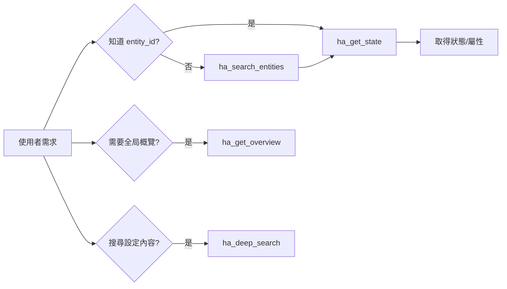

<details>
<summary><b>ha_search_entities</b> — 搜尋實體</summary>

**功能說明：** 依名稱、領域或區域搜尋 Home Assistant 實體（燈光、感應器、開關等）。支援模糊搜尋、精確匹配、分頁和狀態篩選。這是大多數操作的起點。

**參數：**

| 參數 | 類型 | 必填 | 說明 |
|------|------|------|------|
| `query` | string | 否 | 搜尋關鍵字（名稱模糊匹配）|
| `domain_filter` | string | 否 | 依領域篩選（如 `light`、`sensor`、`switch`）|
| `area_filter` | string | 否 | 依區域篩選 |
| `limit` | int | 否 | 回傳數量限制 |
| `exact_match` | bool | 否 | 是否精確匹配 |
| `state_filter` | string | 否 | 依狀態篩選（如 `on`、`off`）|

**Agent 示範：**

```
# Claude Code
使用者：找出所有客廳的燈
→ ha_search_entities(query="客廳", domain_filter="light")

# Hermes Agent
使用者：哪些感應器目前是離線的？
→ ha_search_entities(domain_filter="sensor", state_filter="unavailable")

# OpenClaw
使用者：有哪些開關？
→ ha_search_entities(domain_filter="switch", limit=20)
```

</details>

<details>
<summary><b>ha_get_state</b> — 取得實體狀態</summary>

**功能說明：** 取得一個或多個實體的目前狀態和屬性。支援批量查詢（最多 100 個）和欄位投影以減少回應大小。適用於查詢燈光亮度、溫度感應器數值、開關狀態等。

**參數：**

| 參數 | 類型 | 必填 | 說明 |
|------|------|------|------|
| `entity_id` | string | 是 | 實體 ID，多個以逗號分隔（最多 100）|
| `fields` | string/list | 否 | 投影欄位（如 `state,attributes.brightness`）|
| `attribute_keys` | string/list | 否 | 只回傳指定屬性 |

**Agent 示範：**

```
# 單一實體查詢
→ ha_get_state(entity_id="sensor.living_room_temperature")
回傳: {"state": "24.5", "attributes": {"unit": "°C", ...}}

# 批量查詢（精簡回應）
→ ha_get_state(
    entity_id="light.bedroom,light.living_room,light.kitchen",
    fields="state,attributes.brightness"
  )

# 查看空調完整屬性
→ ha_get_state(entity_id="climate.living_room_ac")
```

</details>

<details>
<summary><b>ha_get_overview</b> — 系統概覽</summary>

**功能說明：** 取得 AI 友善的系統概覽，包含 Home Assistant 版本、位置、時區、實體統計和持續通知。是 Agent 開始工作前了解系統狀態的最佳工具。

**參數：**

| 參數 | 類型 | 必填 | 說明 |
|------|------|------|------|
| `detail_level` | string | 否 | 詳細等級：`minimal`、`normal`、`full` |
| `domains` | string/list | 否 | 只顯示特定領域 |
| `limit` | int | 否 | 每個領域顯示的實體數 |
| `offset` | int | 否 | 分頁偏移 |
| `fields` | string/list | 否 | 回應欄位投影 |

**Agent 示範：**

```
# 快速了解系統概況
→ ha_get_overview(detail_level="minimal")

# 只看燈光和感應器
→ ha_get_overview(domains=["light", "sensor"])

# 完整系統報告
→ ha_get_overview(detail_level="full")
```

</details>

<details>
<summary><b>ha_deep_search</b> — 深度搜尋</summary>

**功能說明：** 搜尋自動化、腳本、場景、輔助和儀表板的設定內容。用於查找哪些設定使用了特定服務、實體或動作。與 `ha_search_entities` 不同，此工具搜尋的是設定檔案的內容。

**參數：**

| 參數 | 類型 | 必填 | 說明 |
|------|------|------|------|
| `query` | string | 是 | 搜尋關鍵字 |
| `search_types` | list | 否 | 搜尋範圍（`automation`、`script`、`scene`、`dashboard`）|
| `limit` | int | 否 | 回傳數量限制 |
| `offset` | int | 否 | 分頁偏移 |
| `exact_match` | bool | 否 | 精確匹配 |

**Agent 示範：**

```
# 找出所有引用客廳燈的自動化
→ ha_deep_search(query="light.living_room", search_types=["automation"])

# 搜尋使用特定服務的設定
→ ha_deep_search(query="notify.mobile_app")

# 找出儀表板中使用的實體
→ ha_deep_search(query="sensor.power", search_types=["dashboard"])
```

</details>

---

### 服務與裝置控制 (Service & Device Control)

> 控制智慧家庭的核心工具 —— 開燈、關門、調溫度。

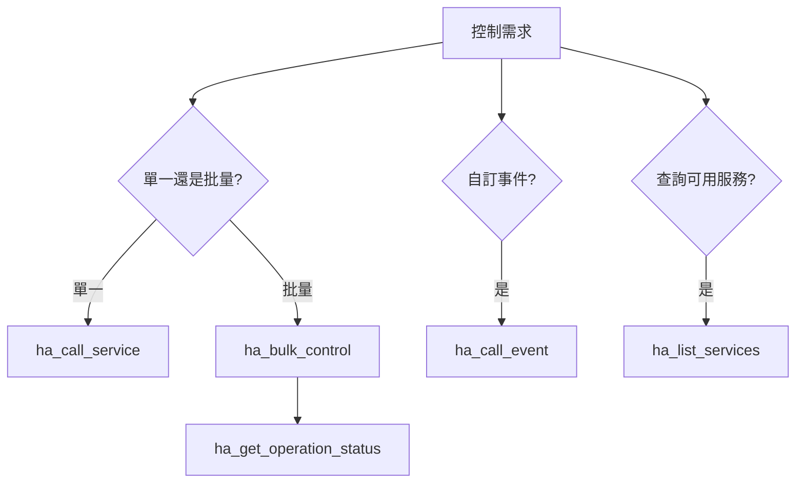

<details>
<summary><b>ha_call_service</b> — 呼叫服務</summary>

**功能說明：** 執行 Home Assistant 服務以控制實體和觸發自動化。這是控制所有 HA 實體的通用工具。服務遵循 `domain.service` 模式（如 `light.turn_on`、`switch.toggle`）。

**參數：**

| 參數 | 類型 | 必填 | 說明 |
|------|------|------|------|
| `domain` | string | 是 | 服務領域（如 `light`、`switch`、`climate`）|
| `service` | string | 是 | 服務名稱（如 `turn_on`、`toggle`、`set_temperature`）|
| `entity_id` | string | 否 | 目標實體 ID |
| `data` | dict | 否 | 服務資料（亮度、色溫等）|
| `wait` | bool | 否 | 是否等待完成 |

**Agent 示範：**

```
# 開燈
→ ha_call_service(domain="light", service="turn_on",
    entity_id="light.living_room")

# 設定亮度和色溫
→ ha_call_service(domain="light", service="turn_on",
    entity_id="light.bedroom",
    data={"brightness_pct": 50, "color_temp_kelvin": 3000})

# 設定空調溫度
→ ha_call_service(domain="climate", service="set_temperature",
    entity_id="climate.living_room_ac",
    data={"temperature": 25})

# 鎖門
→ ha_call_service(domain="lock", service="lock",
    entity_id="lock.front_door")

# 發送通知
→ ha_call_service(domain="notify", service="mobile_app_iphone",
    data={"message": "有人在門口", "title": "門鈴通知"})
```

</details>

<details>
<summary><b>ha_bulk_control</b> — 批量控制</summary>

**功能說明：** 批量控制多個裝置，支援平行操作和 WebSocket 追蹤。適用於需要同時控制多個裝置的場景（如「全部關燈」、「離家模式」）。

**參數：**

| 參數 | 類型 | 必填 | 說明 |
|------|------|------|------|
| `operations` | list | 是 | 操作清單，每項包含 entity_id 和 action |
| `parallel` | bool | 否 | 是否平行執行 |

**Agent 示範：**

```
# 離家模式：關閉所有燈光和空調
→ ha_bulk_control(operations=[
    {"entity_id": "light.living_room", "action": "off"},
    {"entity_id": "light.bedroom", "action": "off"},
    {"entity_id": "light.kitchen", "action": "off"},
    {"entity_id": "climate.living_room_ac", "action": "off"}
  ], parallel=true)

# 回家模式：開燈 + 開空調
→ ha_bulk_control(operations=[
    {"entity_id": "light.hallway", "action": "on"},
    {"entity_id": "climate.living_room_ac", "action": "on",
     "data": {"temperature": 25}}
  ])
```

</details>

<details>
<summary><b>ha_call_event</b> — 發布事件</summary>

**功能說明：** 在 Home Assistant 事件匯流排上發布自訂事件。用於觸發事件型自動化、Node-RED 流程或自訂整合。事件為「發送即忘」模式。

**參數：**

| 參數 | 類型 | 必填 | 說明 |
|------|------|------|------|
| `event_type` | string | 是 | 事件類型名稱 |
| `data` | dict | 否 | 事件附加資料 |

**Agent 示範：**

```
# 觸發自訂事件
→ ha_call_event(event_type="custom_alarm_triggered",
    data={"zone": "front_door", "severity": "high"})

# 通知 Node-RED
→ ha_call_event(event_type="nodered_command",
    data={"action": "run_flow", "flow_id": "morning_routine"})
```

</details>

<details>
<summary><b>ha_get_operation_status</b> — 查詢操作狀態</summary>

**功能說明：** 透過即時 WebSocket 驗證檢查裝置操作的狀態。用於追蹤由 `ha_bulk_control` 或 `ha_call_service` 啟動的操作是否成功完成。

**參數：**

| 參數 | 類型 | 必填 | 說明 |
|------|------|------|------|
| `operation_id` | string | 是 | 操作 ID（由 bulk_control 回傳）|
| `timeout_seconds` | int | 否 | 等待逾時秒數 |

**Agent 示範：**

```
# 檢查批量操作是否完成
→ ha_get_operation_status(operation_id="op_12345", timeout_seconds=10)
```

</details>

<details>
<summary><b>ha_list_services</b> — 列出可用服務</summary>

**功能說明：** 列出 Home Assistant 可用的服務，支援分頁和詳細等級控制。用於探索可以透過 `ha_call_service` 呼叫的服務和動作。

**參數：**

| 參數 | 類型 | 必填 | 說明 |
|------|------|------|------|
| `domain` | string | 否 | 篩選特定領域 |
| `query` | string | 否 | 搜尋關鍵字 |
| `limit` | int | 否 | 回傳數量限制 |
| `offset` | int | 否 | 分頁偏移 |
| `detail_level` | string | 否 | 詳細等級 |

**Agent 示範：**

```
# 查看 light 領域的所有服務
→ ha_list_services(domain="light")

# 搜尋通知相關服務
→ ha_list_services(query="notify")

# 查看所有可用服務（概要）
→ ha_list_services(detail_level="minimal", limit=50)
```

</details>

---

### 自動化 (Automations)

> 自動化是智慧家庭的大腦 —— 定義觸發條件和執行動作。

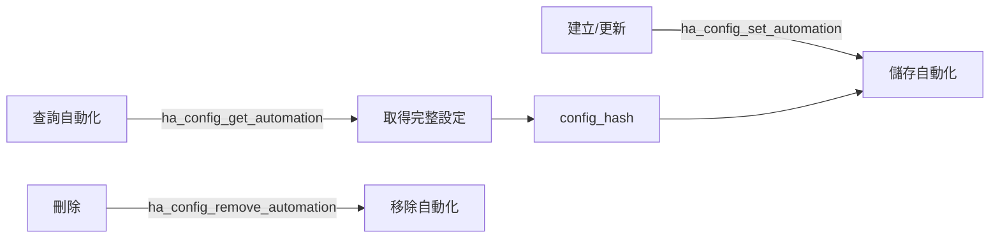

<details>
<summary><b>ha_config_get_automation</b> — 取得自動化設定</summary>

**功能說明：** 擷取 Home Assistant 自動化的完整設定，包括觸發器、條件、動作和模式設定。回傳穩定的 `config_hash` 供後續更新時做衝突偵測。

**參數：**

| 參數 | 類型 | 必填 | 說明 |
|------|------|------|------|
| `identifier` | string | 是 | 自動化的 entity_id 或 unique_id |

**Agent 示範：**

```
→ ha_config_get_automation(identifier="automation.morning_lights")
回傳: {
  "alias": "早晨自動開燈",
  "trigger": [...],
  "condition": [...],
  "action": [...],
  "mode": "single",
  "config_hash": "abc123..."
}
```

</details>

<details>
<summary><b>ha_config_set_automation</b> — 建立或更新自動化</summary>

**功能說明：** 建立或更新 Home Assistant 自動化。支援完整設定替換或 Python 轉換模式進行局部更新。也支援藍圖自動化。更新時建議提供 `config_hash` 避免覆寫他人變更。

**參數：**

| 參數 | 類型 | 必填 | 說明 |
|------|------|------|------|
| `config` | dict | 否 | 完整自動化設定 |
| `identifier` | string | 否 | 更新時指定目標（entity_id 或 unique_id）|
| `python_transform` | string | 否 | Python 表達式進行局部更新 |
| `config_hash` | string | 否 | 衝突偵測用的 hash |
| `category` | string | 否 | 分類 ID |

**Agent 示範：**

```
# 建立新自動化：日落時開燈
→ ha_config_set_automation(config={
    "alias": "日落自動開燈",
    "description": "太陽下山後自動開啟客廳燈光",
    "trigger": [
      {"platform": "sun", "event": "sunset", "offset": "-00:30:00"}
    ],
    "condition": [
      {"condition": "state", "entity_id": "person.owner", "state": "home"}
    ],
    "action": [
      {"service": "light.turn_on",
       "target": {"entity_id": "light.living_room"},
       "data": {"brightness_pct": 80}}
    ],
    "mode": "single"
  })

# 局部更新：只改觸發時間
→ ha_config_set_automation(
    identifier="automation.sunset_lights",
    python_transform="config['trigger'][0]['offset'] = '-01:00:00'",
    config_hash="abc123..."
  )

# 藍圖自動化
→ ha_config_set_automation(config={
    "alias": "動作偵測開燈",
    "use_blueprint": {
      "path": "homeassistant/motion_light.yaml",
      "input": {
        "motion_entity": "binary_sensor.hallway_motion",
        "light_target": {"entity_id": "light.hallway"},
        "no_motion_wait": 120
      }
    }
  })
```

</details>

<details>
<summary><b>ha_config_remove_automation</b> — 刪除自動化</summary>

**功能說明：** 永久刪除一個 Home Assistant 自動化。支援透過 entity_id 或 unique_id 指定目標。

**參數：**

| 參數 | 類型 | 必填 | 說明 |
|------|------|------|------|
| `identifier` | string | 是 | entity_id 或 unique_id |
| `wait` | bool | 否 | 是否等待確認刪除完成 |

**Agent 示範：**

```
→ ha_config_remove_automation(identifier="automation.old_morning_routine")
```

</details>

---

### 腳本 (Scripts)

> 腳本是可重複執行的動作序列 —— 像是自訂的「巨集」。

<details>
<summary><b>ha_config_get_script</b> — 取得腳本設定</summary>

**功能說明：** 擷取 Home Assistant 腳本的完整設定，包括 sequence、mode、fields 和其他設定。回傳穩定的 `config_hash`。

**參數：**

| 參數 | 類型 | 必填 | 說明 |
|------|------|------|------|
| `script_id` | string | 是 | 腳本 ID |

**Agent 示範：**

```
→ ha_config_get_script(script_id="script.good_night")
```

</details>

<details>
<summary><b>ha_config_set_script</b> — 建立或更新腳本</summary>

**功能說明：** 建立或更新 Home Assistant 腳本。腳本使用 `sequence` 定義動作序列（非 `trigger` 或 `action`）。支援完整設定替換或 Python 轉換模式。

**參數：**

| 參數 | 類型 | 必填 | 說明 |
|------|------|------|------|
| `script_id` | string | 是 | 腳本 ID |
| `config` | dict | 否 | 完整腳本設定 |
| `python_transform` | string | 否 | Python 局部更新 |
| `config_hash` | string | 否 | 衝突偵測 hash |
| `category` | string | 否 | 分類 ID |

**Agent 示範：**

```
# 建立「晚安」腳本
→ ha_config_set_script(script_id="good_night", config={
    "alias": "晚安模式",
    "sequence": [
      {"service": "light.turn_off", "target": {"area_id": "living_room"}},
      {"service": "light.turn_on",
       "target": {"entity_id": "light.bedroom"},
       "data": {"brightness_pct": 10, "color_temp_kelvin": 2700}},
      {"service": "lock.lock", "target": {"entity_id": "lock.front_door"}},
      {"delay": "00:00:30"},
      {"service": "light.turn_off",
       "target": {"entity_id": "light.bedroom"}}
    ],
    "mode": "single",
    "icon": "mdi:weather-night"
  })
```

</details>

<details>
<summary><b>ha_config_remove_script</b> — 刪除腳本</summary>

**功能說明：** 刪除一個 Home Assistant 腳本。僅適用於 UI 建立的腳本。

**參數：**

| 參數 | 類型 | 必填 | 說明 |
|------|------|------|------|
| `script_id` | string | 是 | 腳本 ID |
| `wait` | bool | 否 | 等待確認 |

**Agent 示範：**

```
→ ha_config_remove_script(script_id="script.old_routine")
```

</details>

---

### 場景 (Scenes)

> 場景是「快照」—— 一鍵回復到預設的裝置狀態。

<details>
<summary><b>ha_config_get_scene</b> — 取得場景設定</summary>

**功能說明：** 擷取場景的完整設定，包括所有實體的目標狀態字典。

**參數：**

| 參數 | 類型 | 必填 | 說明 |
|------|------|------|------|
| `scene_id` | string | 是 | 場景 ID |

**Agent 示範：**

```
→ ha_config_get_scene(scene_id="scene.movie_time")
```

</details>

<details>
<summary><b>ha_config_set_scene</b> — 建立或更新場景</summary>

**功能說明：** 建立或更新場景。場景的 `entities` 是以 entity_id 為鍵的字典，值為該實體在場景中的目標狀態。

**參數：**

| 參數 | 類型 | 必填 | 說明 |
|------|------|------|------|
| `scene_id` | string | 是 | 場景 ID |
| `config` | dict | 否 | 完整場景設定 |
| `python_transform` | string | 否 | Python 局部更新 |
| `config_hash` | string | 否 | 衝突偵測 |
| `category` | string | 否 | 分類 |

**Agent 示範：**

```
# 建立「電影時間」場景
→ ha_config_set_scene(scene_id="movie_time", config={
    "name": "電影時間",
    "entities": {
      "light.living_room": {"state": "on", "brightness": 30},
      "light.kitchen": {"state": "off"},
      "media_player.tv": {"state": "on"},
      "cover.living_room_curtain": {"state": "closed"}
    },
    "icon": "mdi:movie-open"
  })
```

</details>

<details>
<summary><b>ha_config_remove_scene</b> — 刪除場景</summary>

**功能說明：** 刪除一個場景。僅適用於 UI 建立的場景。

**參數：**

| 參數 | 類型 | 必填 | 說明 |
|------|------|------|------|
| `scene_id` | string | 是 | 場景 ID |
| `wait` | bool | 否 | 等待確認 |

</details>

---

### 儀表板 (Dashboards)

> 儀表板是視覺化控制中心 —— 支援複雜的卡片佈局和資源管理。

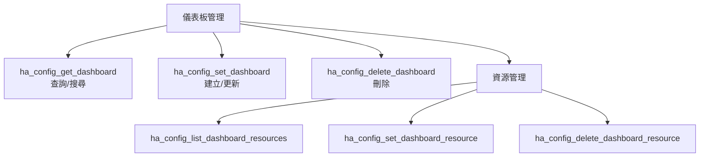

<details>
<summary><b>ha_config_get_dashboard</b> — 取得儀表板</summary>

**功能說明：** 取得儀表板資訊。可列出所有儀表板、取得特定儀表板的完整設定，或搜尋包含特定實體/卡片類型的卡片。

**參數：**

| 參數 | 類型 | 必填 | 說明 |
|------|------|------|------|
| `url_path` | string | 否 | 儀表板 URL 路徑（如 `lovelace`）|
| `list_only` | bool | 否 | 僅列出儀表板清單 |
| `force_reload` | bool | 否 | 強制重新載入 |
| `entity_id` | string | 否 | 搜尋使用此實體的卡片 |
| `card_type` | string | 否 | 搜尋特定類型的卡片 |
| `heading` | string | 否 | 搜尋標題 |

**Agent 示範：**

```
# 列出所有儀表板
→ ha_config_get_dashboard(list_only=true)

# 取得特定儀表板設定
→ ha_config_get_dashboard(url_path="lovelace")

# 搜尋使用特定實體的卡片
→ ha_config_get_dashboard(url_path="lovelace",
    entity_id="sensor.living_room_temperature")
```

</details>

<details>
<summary><b>ha_config_set_dashboard</b> — 建立或更新儀表板</summary>

**功能說明：** 建立或更新 Home Assistant 儀表板。支援完整設定替換或 Python 轉換模式。支援現代 sections 檢視和策略型儀表板。

**參數：**

| 參數 | 類型 | 必填 | 說明 |
|------|------|------|------|
| `url_path` | string | 是 | 儀表板 URL 路徑 |
| `config` | dict | 否 | 完整設定 |
| `python_transform` | string | 否 | Python 局部更新 |
| `config_hash` | string | 否 | 衝突偵測 |
| `title` | string | 否 | 儀表板標題 |
| `icon` | string | 否 | 側邊欄圖示 |

**Agent 示範：**

```
# 建立簡易儀表板
→ ha_config_set_dashboard(url_path="my-home", title="我的家",
    config={
      "views": [{
        "title": "總覽",
        "cards": [
          {"type": "entities", "entities": [
            "light.living_room", "light.bedroom",
            "sensor.temperature", "switch.fan"
          ]}
        ]
      }]
    })

# 用 Python 轉換新增卡片
→ ha_config_set_dashboard(
    url_path="lovelace",
    python_transform="config['views'][0]['cards'].append({'type': 'weather-forecast', 'entity': 'weather.home'})",
    config_hash="xyz789..."
  )
```

</details>

<details>
<summary><b>ha_config_delete_dashboard</b> — 刪除儀表板</summary>

**功能說明：** 永久刪除一個儲存模式的儀表板。此操作不可復原。

**參數：**

| 參數 | 類型 | 必填 | 說明 |
|------|------|------|------|
| `url_path` | string | 是 | 儀表板 URL 路徑 |

</details>

<details>
<summary><b>ha_config_list_dashboard_resources</b> — 列出儀表板資源</summary>

**功能說明：** 列出所有 Lovelace 儀表板資源（自訂卡片、主題、CSS/JS）。

**參數：**

| 參數 | 類型 | 必填 | 說明 |
|------|------|------|------|
| `include_content` | bool | 否 | 包含內嵌資源的完整內容 |

</details>

<details>
<summary><b>ha_config_set_dashboard_resource</b> — 設定儀表板資源</summary>

**功能說明：** 建立或更新儀表板資源，支援內嵌程式碼或外部 URL 模式。

**參數：**

| 參數 | 類型 | 必填 | 說明 |
|------|------|------|------|
| `content` | string | 否 | 內嵌程式碼內容 |
| `url` | string | 否 | 外部資源 URL |
| `resource_type` | string | 否 | 資源類型（`module`、`js`、`css`）|
| `resource_id` | string | 否 | 更新時指定資源 ID |

**Agent 示範：**

```
# 新增外部自訂卡片
→ ha_config_set_dashboard_resource(
    url="/hacsfiles/mushroom-cards/mushroom.js",
    resource_type="module"
  )
```

</details>

<details>
<summary><b>ha_config_delete_dashboard_resource</b> — 刪除儀表板資源</summary>

**功能說明：** 刪除一個儀表板資源。

**參數：**

| 參數 | 類型 | 必填 | 說明 |
|------|------|------|------|
| `resource_id` | string | 是 | 資源 ID |

</details>

---

### 實體登錄 (Entity Registry)

> 管理實體的中繼資料 —— 名稱、圖示、區域指派、語音助理公開。

<details>
<summary><b>ha_get_entity</b> — 取得實體登錄資訊</summary>

**功能說明：** 取得實體的登錄資訊（非即時狀態），包含區域指派、自訂名稱/圖示、啟用/隱藏狀態、別名和標籤等中繼資料。

**參數：**

| 參數 | 類型 | 必填 | 說明 |
|------|------|------|------|
| `entity_id` | string | 是 | 實體 ID（多個以逗號分隔）|

**Agent 示範：**

```
→ ha_get_entity(entity_id="light.living_room")
回傳: {
  "entity_id": "light.living_room",
  "name": "客廳燈",
  "area_id": "living_room",
  "labels": ["主要照明"],
  "disabled_by": null,
  ...
}
```

</details>

<details>
<summary><b>ha_set_entity</b> — 更新實體屬性</summary>

**功能說明：** 更新實體登錄中的屬性，包括區域指派、顯示名稱、圖示、標籤、語音助理公開等。支援批量操作和實體 ID 重新命名。

**參數：**

| 參數 | 類型 | 必填 | 說明 |
|------|------|------|------|
| `entity_id` | string | 是 | 實體 ID |
| `area_id` | string | 否 | 區域 ID |
| `name` | string | 否 | 顯示名稱 |
| `icon` | string | 否 | 圖示 |
| `labels` | list | 否 | 標籤列表 |
| `expose_to` | dict | 否 | 語音助理公開設定 |
| `new_entity_id` | string | 否 | 重新命名實體 ID |

**Agent 示範：**

```
# 設定區域和名稱
→ ha_set_entity(entity_id="sensor.temp_1",
    area_id="living_room", name="客廳溫度計")

# 對 Alexa 公開
→ ha_set_entity(entity_id="light.bedroom",
    expose_to={"alexa": true, "google_assistant": true})
```

</details>

<details>
<summary><b>ha_remove_entity</b> — 移除實體</summary>

**功能說明：** 永久移除實體。僅用於孤立或過期的實體。若裝置仍在運作，實體可能在重啟後被重新添加。

**參數：**

| 參數 | 類型 | 必填 | 說明 |
|------|------|------|------|
| `entity_id` | string | 是 | 實體 ID |

</details>

<details>
<summary><b>ha_get_entity_exposure</b> — 取得語音助理公開設定</summary>

**功能說明：** 查看實體對語音助理（Alexa、Google Assistant、Assist）的公開設定。

**參數：**

| 參數 | 類型 | 必填 | 說明 |
|------|------|------|------|
| `entity_id` | string | 否 | 實體 ID（空值列出全部）|
| `assistant` | string | 否 | 篩選特定助理 |

</details>

---

### 裝置登錄 (Device Registry)

> 管理實體裝置 —— 含 Zigbee、Z-Wave 和 WiFi 裝置。

<details>
<summary><b>ha_get_device</b> — 取得裝置資訊</summary>

**功能說明：** 取得裝置資訊（含 Zigbee/ZHA/Z2M 和 Z-Wave JS 裝置），支援分頁、篩選和單一裝置詳細查詢。

**參數：**

| 參數 | 類型 | 必填 | 說明 |
|------|------|------|------|
| `device_id` | string | 否 | 特定裝置 ID |
| `entity_id` | string | 否 | 透過實體找裝置 |
| `integration` | string | 否 | 篩選整合（如 `zha`、`zwave_js`）|
| `area_id` | string | 否 | 篩選區域 |
| `manufacturer` | string | 否 | 篩選製造商 |
| `limit` | int | 否 | 數量限制 |
| `offset` | int | 否 | 分頁偏移 |

**Agent 示範：**

```
# 列出所有 Zigbee 裝置
→ ha_get_device(integration="zha")

# 查看特定裝置
→ ha_get_device(entity_id="light.living_room")

# 列出客廳的所有裝置
→ ha_get_device(area_id="living_room")
```

</details>

<details>
<summary><b>ha_set_device</b> — 更新裝置屬性</summary>

**功能說明：** 更新裝置名稱、區域、停用狀態或標籤。注意：重新命名裝置不會自動重新命名其實體。

**參數：**

| 參數 | 類型 | 必填 | 說明 |
|------|------|------|------|
| `device_id` | string | 是 | 裝置 ID |
| `name` | string | 否 | 裝置名稱 |
| `area_id` | string | 否 | 區域 ID |
| `disabled_by` | string | 否 | 停用來源 |
| `labels` | list | 否 | 標籤列表 |

</details>

<details>
<summary><b>ha_remove_device</b> — 移除裝置</summary>

**功能說明：** 從裝置登錄中移除孤立裝置。僅用於不再連接的裝置。

**參數：**

| 參數 | 類型 | 必填 | 說明 |
|------|------|------|------|
| `device_id` | string | 是 | 裝置 ID |

</details>

---

### 輔助實體 (Helper Entities)

> 虛擬實體用於自動化邏輯 —— 計數器、計時器、輸入布林值等。

<details>
<summary><b>ha_config_list_helpers</b> — 列出輔助實體</summary>

**功能說明：** 列出指定類型的所有輔助實體及其完整設定。支援 12 種輔助類型（input_boolean、counter、timer、schedule 等）。

**參數：**

| 參數 | 類型 | 必填 | 說明 |
|------|------|------|------|
| `helper_type` | string | 是 | 輔助類型（如 `input_boolean`、`counter`、`timer`）|

**Agent 示範：**

```
→ ha_config_list_helpers(helper_type="input_boolean")
→ ha_config_list_helpers(helper_type="timer")
```

</details>

<details>
<summary><b>ha_config_set_helper</b> — 建立或更新輔助實體</summary>

**功能說明：** 統一介面支援 28 種輔助類型的建立與更新。包括簡單型（input_*、counter、timer）、流程型（template、group、utility_meter）和設定子條目型。

**參數：**

| 參數 | 類型 | 必填 | 說明 |
|------|------|------|------|
| `helper_type` | string | 是 | 輔助類型 |
| `name` | string | 否 | 名稱 |
| `helper_id` | string | 否 | 更新時的 ID |
| `config` | dict | 否 | 額外設定 |
| `icon` | string | 否 | 圖示 |

**Agent 示範：**

```
# 建立開關型輔助
→ ha_config_set_helper(helper_type="input_boolean",
    name="訪客模式", icon="mdi:account-group")

# 建立計數器
→ ha_config_set_helper(helper_type="counter",
    name="門鈴按鈕次數", config={"initial": 0, "step": 1})

# 建立計時器
→ ha_config_set_helper(helper_type="timer",
    name="烤箱計時器", config={"duration": "01:00:00"})
```

</details>

<details>
<summary><b>ha_remove_helpers_integrations</b> — 移除輔助或整合</summary>

**功能說明：** 移除輔助實體或整合設定條目。統一了三種後端移除機制。

**參數：**

| 參數 | 類型 | 必填 | 說明 |
|------|------|------|------|
| `target` | string | 是 | 目標 ID |
| `helper_type` | string | 否 | 輔助類型 |
| `subentry_id` | string | 否 | 子條目 ID |
| `confirm` | bool | 否 | 確認刪除 |

</details>

---

### 區域與樓層 (Areas & Floors)

> 空間組織 —— 將實體和裝置指派到房間和樓層。

<details>
<summary><b>ha_list_floors_areas</b> — 列出樓層和區域</summary>

**功能說明：** 列出所有樓層及其下屬區域，樓層依等級升序排列。未指派樓層的區域單獨列出。

**參數：**

| 參數 | 類型 | 必填 | 說明 |
|------|------|------|------|
| `fields` | string/list | 否 | 頂層欄位投影 |
| `area_fields` | string/list | 否 | 區域記錄欄位投影 |

**Agent 示範：**

```
→ ha_list_floors_areas()
→ ha_list_floors_areas(area_fields=["area_id", "name"])
```

</details>

<details>
<summary><b>ha_set_area_or_floor</b> — 建立或更新區域/樓層</summary>

**功能說明：** 建立或更新區域/樓層。提供 name 建立新條目，提供 id 更新現有條目。

**參數：**

| 參數 | 類型 | 必填 | 說明 |
|------|------|------|------|
| `kind` | string | 是 | `area` 或 `floor` |
| `name` | string | 否 | 名稱（建立時必填）|
| `id` | string | 否 | ID（更新時必填）|
| `floor_id` | string | 否 | 所屬樓層（僅 area）|
| `level` | int | 否 | 樓層等級（僅 floor）|
| `icon` | string | 否 | 圖示 |

**Agent 示範：**

```
# 建立樓層
→ ha_set_area_or_floor(kind="floor", name="一樓", level=1)

# 建立區域並指派樓層
→ ha_set_area_or_floor(kind="area", name="客廳", floor_id="ground_floor")
```

</details>

<details>
<summary><b>ha_remove_area_or_floor</b> — 移除區域/樓層</summary>

**功能說明：** 移除區域或樓層。移除區域會取消其實體指派，移除樓層會取消其區域指派。

**參數：**

| 參數 | 類型 | 必填 | 說明 |
|------|------|------|------|
| `kind` | string | 是 | `area` 或 `floor` |
| `id` | string | 是 | 區域或樓層 ID |

</details>

---

### 標籤與分類 (Labels & Categories)

> 彈性的組織系統 —— 標籤可跨領域，分類按範圍。

<details>
<summary><b>ha_config_get_label</b> — 取得標籤</summary>

**功能說明：** 列出所有標籤或查詢特定標籤。

**參數：**

| 參數 | 類型 | 必填 | 說明 |
|------|------|------|------|
| `label_id` | string | 否 | 特定標籤 ID |

</details>

<details>
<summary><b>ha_config_set_label</b> — 建立或更新標籤</summary>

**功能說明：** 建立或更新標籤。標籤可跨領域套用於實體、裝置和區域。

**參數：**

| 參數 | 類型 | 必填 | 說明 |
|------|------|------|------|
| `name` | string | 是 | 標籤名稱 |
| `label_id` | string | 否 | 更新時的 ID |
| `color` | string | 否 | 顏色 |
| `icon` | string | 否 | 圖示 |
| `description` | string | 否 | 說明 |

**Agent 示範：**

```
→ ha_config_set_label(name="重要設備", color="red", icon="mdi:star")
```

</details>

<details>
<summary><b>ha_config_remove_label</b> — 刪除標籤</summary>

**參數：** `label_id` (必填)

</details>

<details>
<summary><b>ha_config_get_category</b> — 取得分類</summary>

**功能說明：** 取得指定範圍（自動化、腳本、場景、輔助）的分類。

**參數：**

| 參數 | 類型 | 必填 | 說明 |
|------|------|------|------|
| `scope` | string | 是 | 範圍（`automation`、`script`、`scene`、`helper`）|
| `category_id` | string | 否 | 特定分類 ID |

</details>

<details>
<summary><b>ha_config_set_category</b> — 建立或更新分類</summary>

**參數：**

| 參數 | 類型 | 必填 | 說明 |
|------|------|------|------|
| `name` | string | 是 | 分類名稱 |
| `scope` | string | 是 | 範圍 |
| `category_id` | string | 否 | 更新時的 ID |
| `icon` | string | 否 | 圖示 |

**Agent 示範：**

```
→ ha_config_set_category(name="照明控制", scope="automation",
    icon="mdi:lightbulb-group")
```

</details>

<details>
<summary><b>ha_config_remove_category</b> — 刪除分類</summary>

**參數：** `scope` (必填)、`category_id` (必填)

</details>

---

### 歷史與統計 (History & Statistics)

> 資料分析 —— 查看過去發生了什麼、為什麼發生。

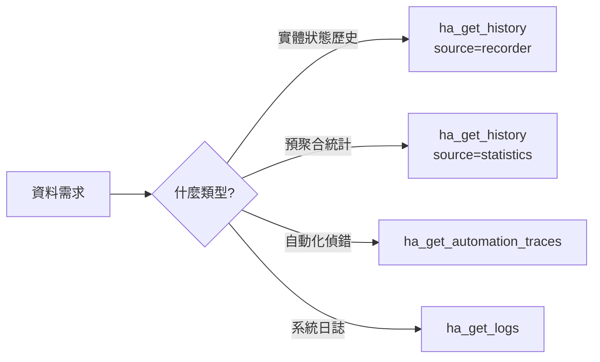

<details>
<summary><b>ha_get_history</b> — 取得歷史資料</summary>

**功能說明：** 從 Home Assistant 紀錄器擷取歷史資料。支援兩種來源：原始狀態變更歷史（約 10 天保留）和預聚合統計資料（永久保留，適合長期趨勢分析）。

**參數：**

| 參數 | 類型 | 必填 | 說明 |
|------|------|------|------|
| `entity_ids` | string | 是 | 實體 ID（多個以逗號分隔）|
| `source` | string | 否 | `recorder`（預設）或 `statistics` |
| `start_time` | string | 否 | 起始時間（ISO 格式）|
| `end_time` | string | 否 | 結束時間 |
| `limit` | int | 否 | 數量限制 |
| `period` | string | 否 | 統計區間（`5minute`、`hour`、`day`、`week`、`month`）|

**Agent 示範：**

```
# 過去 24 小時溫度歷史
→ ha_get_history(entity_ids="sensor.living_room_temperature",
    start_time="2026-05-27T00:00:00")

# 本月用電統計
→ ha_get_history(entity_ids="sensor.total_energy",
    source="statistics", period="day")

# 比較多個感應器
→ ha_get_history(
    entity_ids="sensor.indoor_temp,sensor.outdoor_temp",
    source="statistics", period="hour"
  )
```

</details>

<details>
<summary><b>ha_get_automation_traces</b> — 取得自動化追蹤</summary>

**功能說明：** 擷取自動化和腳本的執行追蹤紀錄以進行除錯。顯示觸發原因、條件通過/失敗、執行的動作和錯誤。

**參數：**

| 參數 | 類型 | 必填 | 說明 |
|------|------|------|------|
| `automation_id` | string | 是 | 自動化 entity_id |
| `run_id` | string | 否 | 特定執行 ID |
| `limit` | int | 否 | 回傳追蹤數量 |
| `detailed` | bool | 否 | 詳細模式 |
| `sections` | list | 否 | 指定區段 |

**Agent 示範：**

```
# 查看最近執行紀錄
→ ha_get_automation_traces(
    automation_id="automation.motion_light",
    limit=5
  )

# 詳細偵錯特定執行
→ ha_get_automation_traces(
    automation_id="automation.motion_light",
    run_id="abc123",
    detailed=true
  )
```

</details>

<details>
<summary><b>ha_get_logs</b> — 取得日誌</summary>

**功能說明：** 從多種來源取得日誌：logbook（實體狀態變更）、system（結構化系統日誌）、error_log（原始日誌）、supervisor（Add-on 容器日誌）和 logger（整合日誌等級）。

**參數：**

| 參數 | 類型 | 必填 | 說明 |
|------|------|------|------|
| `source` | string | 否 | 日誌來源 |
| `limit` | int | 否 | 數量限制 |
| `search` | string | 否 | 搜尋關鍵字 |
| `hours_back` | int | 否 | 回溯時數 |
| `entity_id` | string | 否 | 篩選特定實體 |
| `slug` | string | 否 | Add-on slug（supervisor 來源）|

**Agent 示範：**

```
# 查看最近錯誤
→ ha_get_logs(source="error_log", limit=50)

# 特定實體的活動日誌
→ ha_get_logs(source="logbook", entity_id="light.living_room",
    hours_back=24)

# 查看 Add-on 日誌
→ ha_get_logs(source="supervisor", slug="a0d7b954_nodered")
```

</details>

---

### 行事曆 (Calendar)

> 時間管理 —— 建立、查詢和管理行事曆事件。

<details>
<summary><b>ha_config_get_calendar_events</b> — 取得行事曆事件</summary>

**功能說明：** 從日曆實體擷取指定時間範圍的事件。預設回傳未來 7 天的事件。

**參數：**

| 參數 | 類型 | 必填 | 說明 |
|------|------|------|------|
| `entity_id` | string | 是 | 日曆實體 ID |
| `start` | string | 否 | 起始時間 |
| `end` | string | 否 | 結束時間 |
| `max_results` | int | 否 | 數量限制 |

**Agent 示範：**

```
→ ha_config_get_calendar_events(entity_id="calendar.family")
```

</details>

<details>
<summary><b>ha_config_set_calendar_event</b> — 建立行事曆事件</summary>

**參數：**

| 參數 | 類型 | 必填 | 說明 |
|------|------|------|------|
| `entity_id` | string | 是 | 日曆實體 ID |
| `summary` | string | 是 | 事件標題 |
| `start` | string | 是 | 開始時間 |
| `end` | string | 是 | 結束時間 |
| `description` | string | 否 | 說明 |
| `location` | string | 否 | 地點 |

**Agent 示範：**

```
→ ha_config_set_calendar_event(
    entity_id="calendar.family",
    summary="家庭聚餐",
    start="2026-05-30T18:00:00",
    end="2026-05-30T21:00:00",
    location="客廳"
  )
```

</details>

<details>
<summary><b>ha_config_remove_calendar_event</b> — 刪除行事曆事件</summary>

**參數：** `entity_id` (必填)、`uid` (必填)、`recurrence_id` (選填)、`recurrence_range` (選填)

</details>

---

### 待辦清單 (Todo Lists)

> 任務管理 —— 與 HA 原生待辦清單整合。

<details>
<summary><b>ha_get_todo</b> — 取得待辦清單</summary>

**功能說明：** 不帶 entity_id 列出所有待辦清單；帶 entity_id 取得該清單的項目。

**參數：**

| 參數 | 類型 | 必填 | 說明 |
|------|------|------|------|
| `entity_id` | string | 否 | 待辦清單實體 ID |
| `status` | string | 否 | 狀態篩選 |

**Agent 示範：**

```
# 列出所有待辦清單
→ ha_get_todo()

# 取得特定清單的未完成項目
→ ha_get_todo(entity_id="todo.shopping_list",
    status="needs_action")
```

</details>

<details>
<summary><b>ha_set_todo_item</b> — 建立或更新待辦項目</summary>

**參數：**

| 參數 | 類型 | 必填 | 說明 |
|------|------|------|------|
| `entity_id` | string | 是 | 待辦清單 ID |
| `summary` | string | 否 | 項目標題（建立時必填）|
| `item` | string | 否 | 項目 UID（更新時必填）|
| `status` | string | 否 | 狀態 |
| `description` | string | 否 | 說明 |
| `due_date` | string | 否 | 到期日 |

**Agent 示範：**

```
# 新增購物清單項目
→ ha_set_todo_item(entity_id="todo.shopping_list",
    summary="買牛奶", due_date="2026-05-29")
```

</details>

<details>
<summary><b>ha_remove_todo_item</b> — 刪除待辦項目</summary>

**參數：** `entity_id` (必填)、`item` (必填 - UID 或精確名稱)

</details>

---

### 藍圖 (Blueprints)

> 可重用模板 —— 匯入社群分享的自動化和腳本範本。

<details>
<summary><b>ha_get_blueprint</b> — 取得藍圖</summary>

**功能說明：** 列出已安裝的藍圖，或取得特定藍圖的完整設定（含輸入、觸發器、條件和動作）。

**參數：**

| 參數 | 類型 | 必填 | 說明 |
|------|------|------|------|
| `path` | string | 否 | 藍圖路徑 |
| `domain` | string | 否 | 領域篩選（`automation`、`script`）|

**Agent 示範：**

```
→ ha_get_blueprint(domain="automation")
→ ha_get_blueprint(path="homeassistant/motion_light.yaml")
```

</details>

<details>
<summary><b>ha_import_blueprint</b> — 匯入藍圖</summary>

**功能說明：** 從 URL 匯入藍圖。支援 GitHub、HA 社群論壇或直接 YAML 連結。

**參數：**

| 參數 | 類型 | 必填 | 說明 |
|------|------|------|------|
| `url` | string | 是 | 藍圖 URL |

**Agent 示範：**

```
→ ha_import_blueprint(
    url="https://community.home-assistant.io/t/some-blueprint/12345"
  )
```

</details>

---

### 附加元件 (Add-ons)

> HA OS 專屬 —— 管理附加元件並透過代理呼叫其 API。

<details>
<summary><b>ha_get_addon</b> — 取得附加元件資訊</summary>

**功能說明：** 列出已安裝的附加元件、搜尋可安裝的附加元件，或查詢特定附加元件的詳細資訊（含 Ingress、端口、選項和狀態）。

**參數：**

| 參數 | 類型 | 必填 | 說明 |
|------|------|------|------|
| `slug` | string | 否 | 特定 Add-on slug |
| `source` | string | 否 | `installed` 或 `available` |
| `include_stats` | bool | 否 | 包含 CPU/記憶體使用 |
| `repository` | string | 否 | 篩選存放庫 |
| `query` | string | 否 | 搜尋關鍵字 |

**Agent 示範：**

```
# 列出已安裝的 Add-on
→ ha_get_addon()

# 查看 Node-RED 詳細資訊
→ ha_get_addon(slug="a0d7b954_nodered")

# 搜尋 MQTT 相關 Add-on
→ ha_get_addon(source="available", query="mqtt")
```

</details>

<details>
<summary><b>ha_manage_addon</b> — 管理附加元件</summary>

**功能說明：** 更新 Add-on 設定、透過 Ingress 代理呼叫內部 API，或對陣列端點執行原子式修補。三種操作模式：設定模式、代理模式和陣列修補模式。

**參數：**

| 參數 | 類型 | 必填 | 說明 |
|------|------|------|------|
| `slug` | string | 是 | Add-on slug |
| `path` | string | 否 | API 路徑（代理模式）|
| `method` | string | 否 | HTTP 方法 |
| `body` | dict/string | 否 | 請求主體 |
| `options` | dict | 否 | 設定值（設定模式）|
| `websocket` | bool | 否 | 使用 WebSocket |
| `array_patch` | dict | 否 | 陣列修補操作 |
| `python_transform` | string | 否 | 回應後處理 |

**Agent 示範：**

```
# 更新 Add-on 設定
→ ha_manage_addon(slug="a0d7b954_nodered",
    options={"credential_secret": "new_secret"})

# 透過代理呼叫 Node-RED API
→ ha_manage_addon(slug="a0d7b954_nodered",
    path="/flows", method="GET")

# 原子修補 Node-RED 流程
→ ha_manage_addon(slug="a0d7b954_nodered",
    path="/flows",
    array_patch={"operations": [
      {"op": "patch", "id": "node123", "patches": {"name": "新名稱"}}
    ]})
```

</details>

---

### HACS

> 社群商店 —— 搜尋、安裝和管理社群建立的整合和卡片。

<details>
<summary><b>ha_hacs_search</b> — 搜尋 HACS 商店</summary>

**功能說明：** 搜尋 HACS 商店中的存放庫，或列出已安裝的存放庫。

**參數：**

| 參數 | 類型 | 必填 | 說明 |
|------|------|------|------|
| `query` | string | 否 | 搜尋關鍵字 |
| `category` | string | 否 | 類別篩選（`integration`、`frontend`、`theme`）|
| `installed_only` | bool | 否 | 僅列出已安裝 |
| `max_results` | int | 否 | 數量限制 |

**Agent 示範：**

```
→ ha_hacs_search(query="mushroom", category="frontend")
→ ha_hacs_search(installed_only=true)
```

</details>

<details>
<summary><b>ha_hacs_add_repository</b> — 新增 HACS 存放庫</summary>

**參數：** `repository` (必填 - GitHub 路徑)、`category` (必填)

</details>

<details>
<summary><b>ha_hacs_download</b> — 下載安裝 HACS 存放庫</summary>

**參數：** `repository_id` (必填)、`version` (選填)

</details>

<details>
<summary><b>ha_hacs_repository_info</b> — 取得存放庫資訊</summary>

**參數：** `repository_id` (必填)

</details>

---

### 整合管理 (Integrations)

> 整合設定 —— 管理 HA 與外部服務的連接。

<details>
<summary><b>ha_get_integration</b> — 取得整合資訊</summary>

**功能說明：** 取得整合（設定條目）資訊。可列出所有整合，或查詢特定條目的詳細資訊（含完整選項、診斷和子條目）。

**參數：**

| 參數 | 類型 | 必填 | 說明 |
|------|------|------|------|
| `entry_id` | string | 否 | 特定條目 ID |
| `query` | string | 否 | 搜尋關鍵字 |
| `domain` | string | 否 | 篩選領域 |
| `include_options` | bool | 否 | 包含完整選項 |
| `include_diagnostics` | bool | 否 | 包含診斷資訊 |
| `limit` | int | 否 | 數量限制 |

**Agent 示範：**

```
→ ha_get_integration(domain="zha")
→ ha_get_integration(entry_id="abc123", include_diagnostics=true)
```

</details>

<details>
<summary><b>ha_set_integration_enabled</b> — 啟停整合</summary>

**參數：** `entry_id` (必填)、`enabled` (必填)

</details>

<details>
<summary><b>ha_get_system_health</b> — 系統健康狀態</summary>

**功能說明：** 取得系統健康狀態，包括 Zigbee (ZHA)、Z-Wave JS 和各整合的診斷。

**參數：**

| 參數 | 類型 | 必填 | 說明 |
|------|------|------|------|
| `include` | list | 否 | 包含的檢查項目 |
| `config_entry_id` | string | 否 | 特定整合診斷 |
| `diagnostics_fields` | list | 否 | 診斷欄位 |

**Agent 示範：**

```
→ ha_get_system_health()
→ ha_get_system_health(config_entry_id="zha_entry_id",
    include=["diagnostics"])
```

</details>

---

### 群組 (Groups)

> 邏輯分組 —— 將多個實體組合為一個虛擬實體。

<details>
<summary><b>ha_config_list_groups</b> — 列出所有群組</summary>

**功能說明：** 列出所有實體群組及其成員。

**參數：** 無

</details>

<details>
<summary><b>ha_config_set_group</b> — 建立或更新群組</summary>

**參數：**

| 參數 | 類型 | 必填 | 說明 |
|------|------|------|------|
| `object_id` | string | 是 | 群組 ID |
| `entities` | list | 否 | 替換成員列表 |
| `name` | string | 否 | 群組名稱 |
| `icon` | string | 否 | 圖示 |
| `add_entities` | list | 否 | 新增成員 |
| `remove_entities` | list | 否 | 移除成員 |

**Agent 示範：**

```
→ ha_config_set_group(object_id="all_lights",
    name="所有燈光",
    entities=["light.living_room", "light.bedroom", "light.kitchen"])
```

</details>

<details>
<summary><b>ha_config_remove_group</b> — 移除群組</summary>

**參數：** `object_id` (必填)、`wait` (選填)

</details>

---

### 能源 (Energy)

> 能源管理 —— 設定能源儀表板追蹤用電和發電。

<details>
<summary><b>ha_manage_energy_prefs</b> — 管理能源設定</summary>

**功能說明：** 管理能源儀表板偏好設定。支援檢視、設定完整設定，以及新增/移除個別裝置耗電感應器和能源來源。

**參數：**

| 參數 | 類型 | 必填 | 說明 |
|------|------|------|------|
| `mode` | string | 是 | 操作模式（`get`、`set`、`add_device`、`remove_device`、`add_source`、`remove_source`）|
| `config` | dict | 否 | 完整設定（set 模式）|
| `stat_consumption` | string | 否 | 耗電統計 ID |
| `source` | dict | 否 | 能源來源設定 |
| `dry_run` | bool | 否 | 預覽不套用 |

**Agent 示範：**

```
# 查看目前設定
→ ha_manage_energy_prefs(mode="get")

# 新增裝置耗電監控
→ ha_manage_energy_prefs(mode="add_device",
    stat_consumption="sensor.washing_machine_energy")
```

</details>

---

### 攝影機 (Camera)

> 視覺監控 —— 擷取攝影機即時快照。

<details>
<summary><b>ha_get_camera_image</b> — 取得攝影機快照</summary>

**功能說明：** 從攝影機實體擷取即時快照影像，直接回傳影像供視覺 AI 分析。可調整大小以減少 Token 使用。

**參數：**

| 參數 | 類型 | 必填 | 說明 |
|------|------|------|------|
| `entity_id` | string | 是 | 攝影機實體 ID |
| `width` | int | 否 | 影像寬度 |
| `height` | int | 否 | 影像高度 |

**Agent 示範：**

```
# 擷取前門攝影機快照
→ ha_get_camera_image(entity_id="camera.front_door")

# 縮小影像節省 Token
→ ha_get_camera_image(entity_id="camera.front_door",
    width=640, height=480)
```

</details>

---

### 檔案系統 (Files)

> 檔案管理 —— 讀寫 HA 設定目錄中的檔案。

<details>
<summary><b>ha_read_file</b> — 讀取檔案</summary>

**功能說明：** 讀取 HA 設定目錄中的檔案。支援設定檔、日誌和 www/ 資源。secrets.yaml 的值會被遮蔽。

**參數：**

| 參數 | 類型 | 必填 | 說明 |
|------|------|------|------|
| `path` | string | 是 | 檔案路徑 |
| `tail_lines` | int | 否 | 只讀最後 N 行 |

</details>

<details>
<summary><b>ha_write_file</b> — 寫入檔案</summary>

**參數：**

| 參數 | 類型 | 必填 | 說明 |
|------|------|------|------|
| `path` | string | 是 | 檔案路徑 |
| `content` | string | 是 | 檔案內容 |
| `overwrite` | bool | 否 | 覆寫既有檔案 |
| `create_dirs` | bool | 否 | 自動建立目錄 |

**Agent 示範：**

```
# 建立自訂 CSS
→ ha_write_file(path="www/custom-style.css",
    content=":root { --primary-color: #2196F3; }",
    create_dirs=true)
```

</details>

<details>
<summary><b>ha_list_files</b> — 列出檔案</summary>

**參數：** `path` (必填)、`pattern` (選填 - glob 模式)

</details>

<details>
<summary><b>ha_delete_file</b> — 刪除檔案</summary>

**參數：** `path` (必填)、`confirm` (選填)

</details>

---

### 區域 (Zones)

> 地理圍欄 —— 定義地理位置區域（家、辦公室等）。

<details>
<summary><b>ha_get_zone</b> — 取得區域資訊</summary>

**參數：** `zone_id` (選填)

</details>

<details>
<summary><b>ha_set_zone</b> — 建立或更新區域</summary>

**參數：**

| 參數 | 類型 | 必填 | 說明 |
|------|------|------|------|
| `name` | string | 否 | 區域名稱 |
| `latitude` | float | 否 | 緯度 |
| `longitude` | float | 否 | 經度 |
| `zone_id` | string | 否 | 更新時的 ID |
| `radius` | float | 否 | 半徑（公尺）|
| `icon` | string | 否 | 圖示 |
| `passive` | bool | 否 | 被動模式 |

**Agent 示範：**

```
→ ha_set_zone(name="辦公室", latitude=25.0330, longitude=121.5654,
    radius=100, icon="mdi:office-building")
```

</details>

<details>
<summary><b>ha_remove_zone</b> — 移除區域</summary>

**參數：** `zone_id` (必填)

</details>

---

### 語音助理 (Assist)

> 語音管線 —— 管理 HA Assist 語音助理設定。

<details>
<summary><b>ha_manage_pipeline</b> — 管理 Assist 管線</summary>

**功能說明：** 管理 Assist 語音管線。支援列出、取得、建立、更新管線，以及設定偏好管線。

**參數：**

| 參數 | 類型 | 必填 | 說明 |
|------|------|------|------|
| `action` | string | 是 | 動作（`list`、`get`、`create`、`update`、`set_preferred`）|
| `pipeline_id` | string | 否 | 管線 ID |
| `name` | string | 否 | 管線名稱 |
| `conversation_engine` | string | 否 | 對話引擎 |
| `language` | string | 否 | 語言代碼 |

**Agent 示範：**

```
# 列出所有管線
→ ha_manage_pipeline(action="list")

# 建立中文管線
→ ha_manage_pipeline(action="create",
    name="中文助理", language="zh-Hant")
```

</details>

---

### 系統管理 (System)

> 系統維護 —— 設定檢查、重載、重啟、備份和更新。

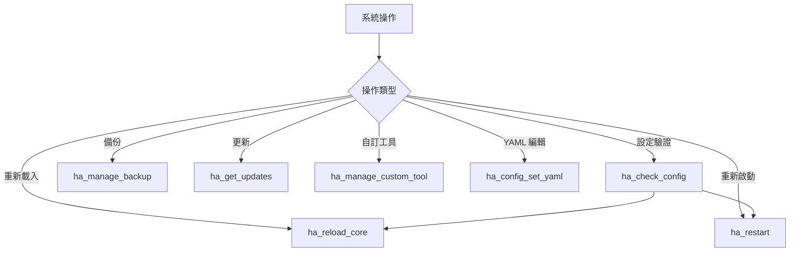

<details>
<summary><b>ha_check_config</b> — 檢查設定</summary>

**功能說明：** 檢查 Home Assistant 設定檔是否有錯誤。僅驗證不套用，應在重啟前執行。

**參數：** 無

**Agent 示範：**

```
→ ha_check_config()
回傳: {"result": "valid"} 或錯誤詳情
```

</details>

<details>
<summary><b>ha_reload_core</b> — 重新載入設定</summary>

**功能說明：** 重新載入 Home Assistant 設定而不需完全重啟。支援自動化、腳本、場景、群組、輔助、模板和主題等。

**參數：**

| 參數 | 類型 | 必填 | 說明 |
|------|------|------|------|
| `target` | string | 否 | 重載目標（如 `automation`、`script`、`scene`、`all`）|

**Agent 示範：**

```
→ ha_reload_core(target="automation")
→ ha_reload_core(target="all")
```

</details>

<details>
<summary><b>ha_restart</b> — 重新啟動</summary>

**功能說明：** 重啟整個 Home Assistant。重啟期間自動化暫停，通常需 1-5 分鐘。

**參數：**

| 參數 | 類型 | 必填 | 說明 |
|------|------|------|------|
| `confirm` | bool | 否 | 需設為 true 才會執行 |

**Agent 示範：**

```
→ ha_check_config()  # 先驗證設定
→ ha_restart(confirm=true)  # 確認後重啟
```

</details>

<details>
<summary><b>ha_manage_backup</b> — 管理備份</summary>

**功能說明：** 多型態備份工具。支援快照（完整 HA 備份）的建立、還原、列出和刪除，以及實體層級自動備份的管理。

**參數：**

| 參數 | 類型 | 必填 | 說明 |
|------|------|------|------|
| `scope` | string | 是 | 範圍（`snapshot` 或 `auto_backup`）|
| `action` | string | 是 | 動作（`create`、`restore`、`list`、`delete`）|
| `name` | string | 否 | 備份名稱 |
| `backup_id` | string | 否 | 備份 ID |

**Agent 示範：**

```
# 建立完整備份
→ ha_manage_backup(scope="snapshot", action="create",
    name="升級前備份")

# 列出所有備份
→ ha_manage_backup(scope="snapshot", action="list")
```

</details>

<details>
<summary><b>ha_get_updates</b> — 取得更新資訊</summary>

**功能說明：** 列出所有可用更新（Core、Add-on、韌體、HACS、OS），或查詢特定更新的詳細資訊。

**參數：**

| 參數 | 類型 | 必填 | 說明 |
|------|------|------|------|
| `entity_id` | string | 否 | 特定更新實體 |
| `include_skipped` | bool | 否 | 包含已跳過的更新 |
| `include_release_notes` | bool | 否 | 包含發行說明 |

**Agent 示範：**

```
→ ha_get_updates()
→ ha_get_updates(entity_id="update.home_assistant_core",
    include_release_notes=true)
```

</details>

<details>
<summary><b>ha_manage_custom_tool</b> — 自訂工具</summary>

**功能說明：** 在沙盒中建立和執行自訂 Python 工具。這是最後手段，應先搜尋現有工具。提供 `api_get`、`api_post`、`ws_send` 和 `call_tool` 函式。

**參數：**

| 參數 | 類型 | 必填 | 說明 |
|------|------|------|------|
| `code` | string | 否 | Python 程式碼 |
| `justification` | string | 否 | 使用理由 |
| `save_as` | string | 否 | 儲存為可重用工具 |
| `run_saved` | string | 否 | 執行已儲存的工具 |
| `list_saved` | bool | 否 | 列出已儲存的工具 |

**Agent 示範：**

```
# 自訂查詢
→ ha_manage_custom_tool(
    code="result = await ws_send('config/entity_registry/list')\nreturn {'count': len(result)}",
    justification="計算實體總數"
  )
```

</details>

<details>
<summary><b>ha_config_set_yaml</b> — YAML 設定編輯</summary>

**功能說明：** 更新 configuration.yaml 或 packages/*.yaml 的原始 YAML 設定。最後手段，僅適用於純 YAML 整合。

**參數：**

| 參數 | 類型 | 必填 | 說明 |
|------|------|------|------|
| `yaml_path` | string | 是 | YAML 內的路徑 |
| `action` | string | 是 | 動作（`get`、`set`、`delete`）|
| `content` | string | 否 | YAML 內容 |
| `file` | string | 否 | 檔案名稱 |
| `backup` | bool | 否 | 建立備份 |

</details>

---

### 工具程式 (Utilities)

> 開發與除錯輔助工具。

<details>
<summary><b>ha_eval_template</b> — 評估 Jinja2 模板</summary>

**功能說明：** 使用 Home Assistant 的模板引擎評估 Jinja2 模板。可存取所有 HA 狀態和函式，用於測試模板表達式。

**參數：**

| 參數 | 類型 | 必填 | 說明 |
|------|------|------|------|
| `template` | string | 是 | Jinja2 模板 |
| `timeout` | int | 否 | 逾時秒數 |
| `report_errors` | bool | 否 | 回報錯誤 |

**Agent 示範：**

```
# 測試模板
→ ha_eval_template(
    template="{{ states('sensor.living_room_temperature') }}°C"
  )

# 複雜模板
→ ha_eval_template(template="""
  
  目前有 {{ lights | count }} 盞燈開著：
  
  - {{ light.name }}
  
""")
```

</details>

<details>
<summary><b>ha_report_issue</b> — 回報問題</summary>

**功能說明：** 收集診斷資訊以提交問題報告或回饋。

**參數：**

| 參數 | 類型 | 必填 | 說明 |
|------|------|------|------|
| `tool_call_count` | int | 否 | 工具呼叫計數 |

</details>

<details>
<summary><b>ha_install_mcp_tools</b> — 安裝 MCP 元件</summary>

**功能說明：** 透過 HACS 安裝 ha_mcp_tools 自訂元件。安裝後需重啟 HA。

**參數：**

| 參數 | 類型 | 必填 | 說明 |
|------|------|------|------|
| `restart` | bool | 否 | 安裝後自動重啟 |

</details>

---

## 常見使用情境

### 情境 1：語音控制全屋燈光

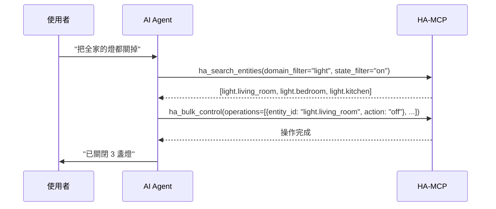

### 情境 2：除錯自動化不觸發

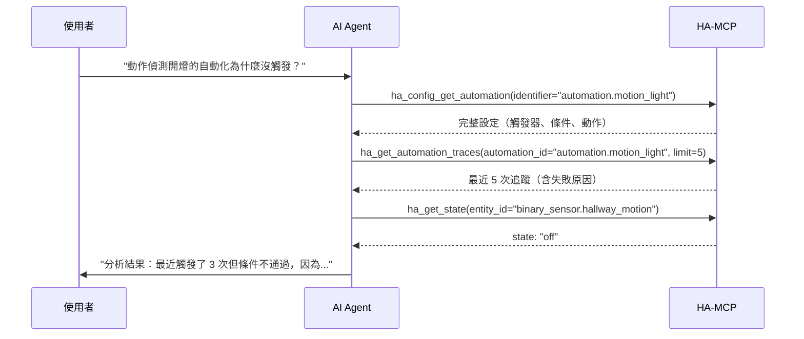

### 情境 3：建立完整智慧家庭場景

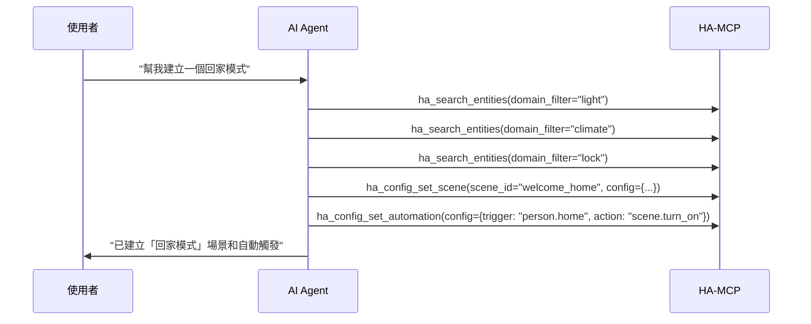

---

## 安全注意事項

| 等級 | 工具 | 說明 |
|------|------|------|
| 唯讀 | ha_search_entities, ha_get_state, ha_get_overview, ha_get_history... | 只讀取不修改 |
| 一般操作 | ha_call_service, ha_config_set_automation... | 控制裝置或修改設定 |
| 破壞性 | ha_restart, ha_remove_entity, ha_config_delete_dashboard... | 可能造成不可逆影響 |

> ha-mcp 內建安全機制：破壞性操作需要 `confirm=true`，重要操作會自動建立備份。

---

## 附錄：工具速查表

| 工具名稱 | 分類 | 唯讀 | 說明 |
|----------|------|------|------|
| ha_search_entities | Search | ✅ | 搜尋實體 |
| ha_get_state | Search | ✅ | 取得狀態 |
| ha_get_overview | Search | ✅ | 系統概覽 |
| ha_deep_search | Search | ✅ | 深度搜尋設定 |
| ha_call_service | Control | ❌ | 呼叫服務 |
| ha_bulk_control | Control | ❌ | 批量控制 |
| ha_call_event | Control | ❌ | 發布事件 |
| ha_get_operation_status | Control | ✅ | 查詢操作狀態 |
| ha_list_services | Control | ✅ | 列出服務 |
| ha_config_get_automation | Automations | ✅ | 取得自動化 |
| ha_config_set_automation | Automations | ❌ | 建立/更新自動化 |
| ha_config_remove_automation | Automations | ❌ | 刪除自動化 |
| ha_config_get_script | Scripts | ✅ | 取得腳本 |
| ha_config_set_script | Scripts | ❌ | 建立/更新腳本 |
| ha_config_remove_script | Scripts | ❌ | 刪除腳本 |
| ha_config_get_scene | Scenes | ✅ | 取得場景 |
| ha_config_set_scene | Scenes | ❌ | 建立/更新場景 |
| ha_config_remove_scene | Scenes | ❌ | 刪除場景 |
| ha_config_get_dashboard | Dashboards | ✅ | 取得儀表板 |
| ha_config_set_dashboard | Dashboards | ❌ | 建立/更新儀表板 |
| ha_config_delete_dashboard | Dashboards | ❌ | 刪除儀表板 |
| ha_config_list_dashboard_resources | Dashboards | ✅ | 列出資源 |
| ha_config_set_dashboard_resource | Dashboards | ❌ | 設定資源 |
| ha_config_delete_dashboard_resource | Dashboards | ❌ | 刪除資源 |
| ha_get_entity | Entity | ✅ | 取得實體登錄 |
| ha_set_entity | Entity | ❌ | 更新實體 |
| ha_remove_entity | Entity | ❌ | 移除實體 |
| ha_get_entity_exposure | Entity | ✅ | 語音公開設定 |
| ha_get_device | Device | ✅ | 取得裝置 |
| ha_set_device | Device | ❌ | 更新裝置 |
| ha_remove_device | Device | ❌ | 移除裝置 |
| ha_config_list_helpers | Helpers | ✅ | 列出輔助 |
| ha_config_set_helper | Helpers | ❌ | 建立/更新輔助 |
| ha_remove_helpers_integrations | Helpers | ❌ | 移除輔助/整合 |
| ha_list_floors_areas | Areas | ✅ | 列出樓層區域 |
| ha_set_area_or_floor | Areas | ❌ | 建立/更新區域 |
| ha_remove_area_or_floor | Areas | ❌ | 移除區域 |
| ha_config_get_label | Labels | ✅ | 取得標籤 |
| ha_config_set_label | Labels | ❌ | 建立/更新標籤 |
| ha_config_remove_label | Labels | ❌ | 刪除標籤 |
| ha_config_get_category | Labels | ✅ | 取得分類 |
| ha_config_set_category | Labels | ❌ | 建立/更新分類 |
| ha_config_remove_category | Labels | ❌ | 刪除分類 |
| ha_get_history | History | ✅ | 取得歷史 |
| ha_get_automation_traces | History | ✅ | 自動化追蹤 |
| ha_get_logs | History | ✅ | 取得日誌 |
| ha_config_get_calendar_events | Calendar | ✅ | 取得事件 |
| ha_config_set_calendar_event | Calendar | ❌ | 建立事件 |
| ha_config_remove_calendar_event | Calendar | ❌ | 刪除事件 |
| ha_get_todo | Todo | ✅ | 取得待辦 |
| ha_set_todo_item | Todo | ❌ | 建立/更新待辦 |
| ha_remove_todo_item | Todo | ❌ | 刪除待辦 |
| ha_get_blueprint | Blueprints | ✅ | 取得藍圖 |
| ha_import_blueprint | Blueprints | ❌ | 匯入藍圖 |
| ha_get_addon | Add-ons | ✅ | 取得 Add-on |
| ha_manage_addon | Add-ons | ❌ | 管理 Add-on |
| ha_hacs_search | HACS | ✅ | 搜尋 HACS |
| ha_hacs_add_repository | HACS | ❌ | 新增存放庫 |
| ha_hacs_download | HACS | ❌ | 下載安裝 |
| ha_hacs_repository_info | HACS | ✅ | 存放庫資訊 |
| ha_get_integration | Integrations | ✅ | 取得整合 |
| ha_set_integration_enabled | Integrations | ❌ | 啟停整合 |
| ha_get_system_health | Integrations | ✅ | 系統健康 |
| ha_config_list_groups | Groups | ✅ | 列出群組 |
| ha_config_set_group | Groups | ❌ | 建立/更新群組 |
| ha_config_remove_group | Groups | ❌ | 移除群組 |
| ha_manage_energy_prefs | Energy | ❌ | 能源設定 |
| ha_get_camera_image | Camera | ✅ | 攝影機快照 |
| ha_read_file | Files | ✅ | 讀取檔案 |
| ha_write_file | Files | ❌ | 寫入檔案 |
| ha_list_files | Files | ✅ | 列出檔案 |
| ha_delete_file | Files | ❌ | 刪除檔案 |
| ha_get_zone | Zones | ✅ | 取得區域 |
| ha_set_zone | Zones | ❌ | 建立/更新區域 |
| ha_remove_zone | Zones | ❌ | 移除區域 |
| ha_manage_pipeline | Assist | ❌ | 管線管理 |
| ha_check_config | System | ✅ | 檢查設定 |
| ha_reload_core | System | ❌ | 重新載入 |
| ha_restart | System | ❌ | 重新啟動 |
| ha_manage_backup | System | ❌ | 備份管理 |
| ha_get_updates | System | ✅ | 更新資訊 |
| ha_manage_custom_tool | System | ❌ | 自訂工具 |
| ha_config_set_yaml | System | ❌ | YAML 編輯 |
| ha_eval_template | Utilities | ✅ | 模板評估 |
| ha_report_issue | Utilities | ✅ | 問題回報 |
| ha_install_mcp_tools | Utilities | ❌ | 安裝元件 |

---

> **維護者**: [WOOWTECH](https://github.com/WOOWTECH)
> **源碼**: [WOOWTECH/ha-mcp](https://github.com/WOOWTECH/ha-mcp)
> **授權**: 商業用途請聯繫 WOOWTECH
